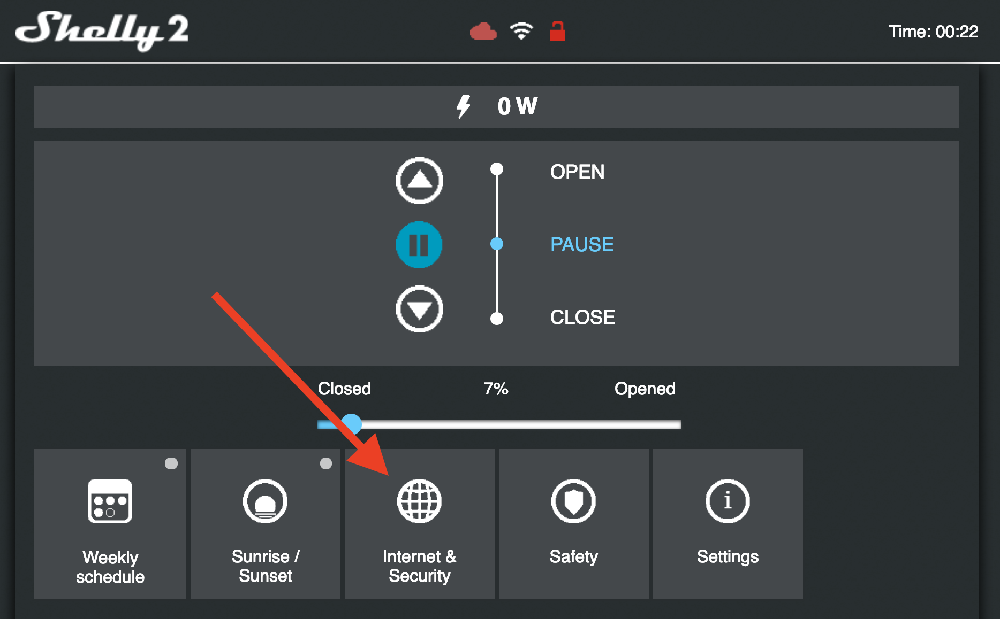
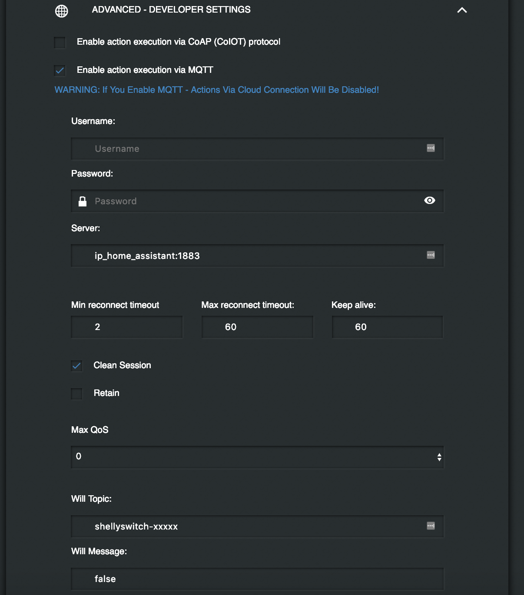

# Roller Shutter con Shelly2

Il package permette di gestire, tramite cover, il movimento di una tapparella utilizzando [Shelly2](http://https://shelly.cloud/).
La comunicazione tra Shelly e Home assistant avviene utilizzando il protocollo MQTT.

### Configurazione Shelly2
Dopo aver collegato Shelly alla propria rete wifi, collegarsi all'indirizzo IP del dispositivo.

Permendo sul pulsante **Internet & Security**

e successivamente su **Advanced - developer settings** e impostare i parametri come in figura:

* Spuntare _Enable action execution via MQTT_
* Username: inserire il nome utente del proprio broker MQTT
* Password: inserire la password del proprio broker MQTT
* Server: inserire l'indirizzo IP e la porta del proprio broker MQTT (tipicamente l'indirizzo ip interno di Home Assistant e la porta 1883)
* Will Topic: impostare [shellyswitch-{DeviceID}](image/DeviceID.png)
* Will Message: impstare false

## Attenzione, la modalità MQTT di shelly disattiva la modalità cloud

 
 
