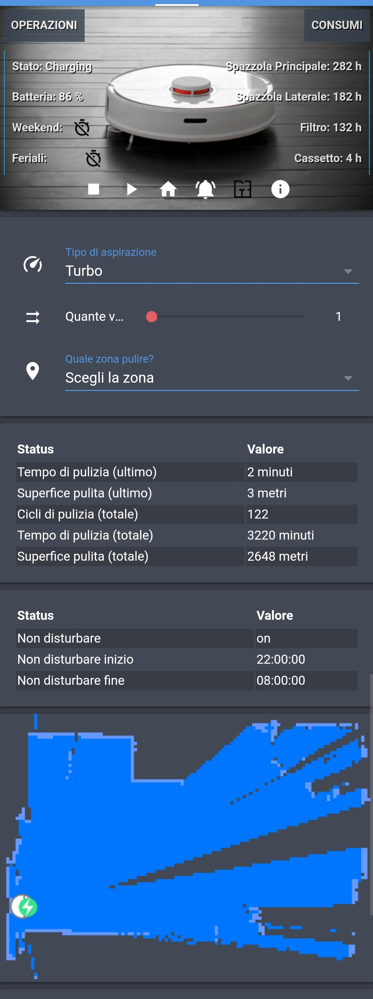

# Package per l'integrazione di Xiaomi Vacuum in Home Assistant

1. Per configurare correttamente il [package](pkg_vacuum_xiaomi.yaml) inserire le seguenti voci nel file `secrets.yaml`

  **Sostituire l'IP indicato con l'indirizzo del proprio vacuum**
```yaml
xiaomi_vacuum_ip: 192.168.1.132
xiaomi_vacuum_token: xxxxxxxxxxxxxxxxxxxx #Token precedentemente ricavato da Mi Home
xiaomi_vacuum_resource_map: http://192.168.1.132/api/remote/map
```
2. Copiare le immagini presenti nella cartella [image](image/) nella cartella /config/www/image di Home Assistant
3. Copiare il file [entity-attributes-card.js](entity-attributes-card.js) nella cartella /config/www di Home Assistant
4. Per visualizzare una scheda personalizzata in lovelace, utilizzare il [seguente codice](ui-lovelace.yaml) integrandolo nel proprio file ui-lovelace.yaml. 
**[importante avere attiva la modalità yaml di lovelace!!](https://www.home-assistant.io/lovelace/yaml-mode/)**
5. Per utilizzare la pulizia a zone _ottimizzata_ installare il custom_component presente [qui](https://github.com/home-assistant/home-assistant/pull/19777) finche la Pull request non verrà approvata.


## Il risultato dovrebbe essere questo:

<div style="text-align:center"></div>