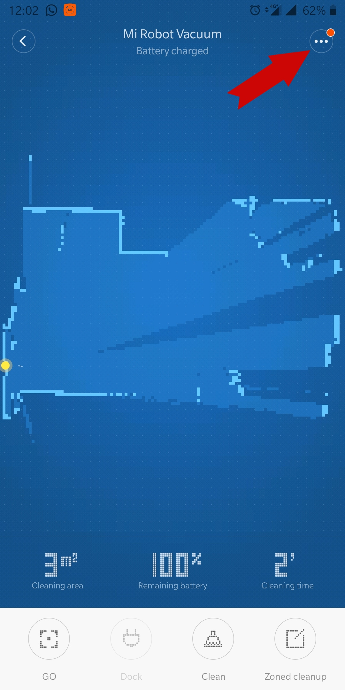
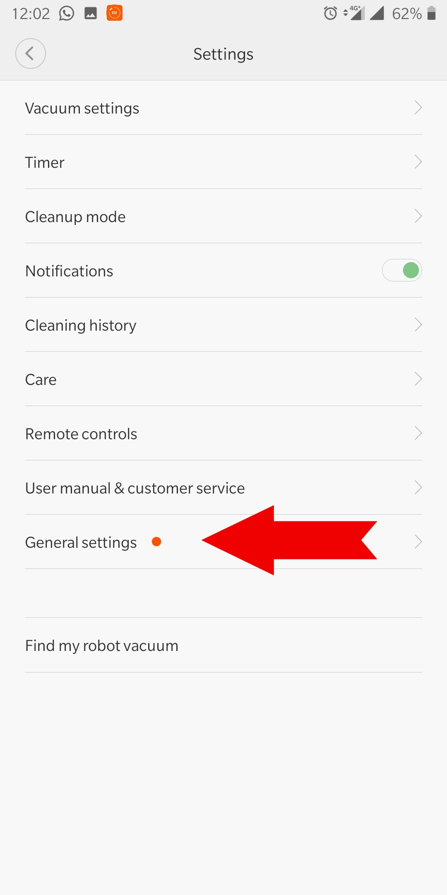
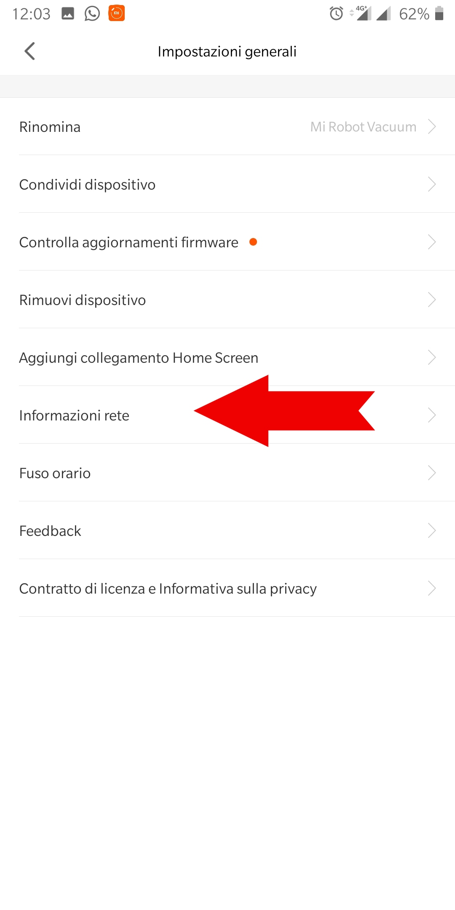
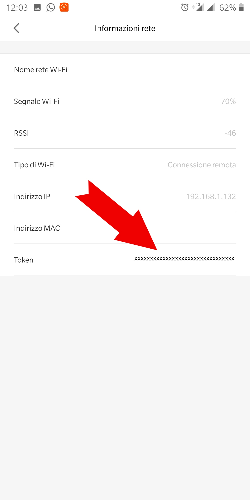

# Xiaomi Vacuum

# 1. [Package per l'integrazione di Xiaomi Vacuum in Home Assistant](PACKAGE.md)
# 2. [Come recuperare il token](#Come-recuperare-il-token)
## 2.1 [MiHome mod by xCape (android)](#MiHome-mod-by-xCape-(android))
## 2.2 [Metodo alternativo](#Metodo-alternativo)
# 3. [Permessi di root su Xioami vacuum](#Permessi-di-root-su-Xioami-vacuum)
# 4. [Utilizzo della mappa in tempo reale in Home Assistant](#Utilizzo-della-mappa-in-tempo-reale-in-Home-Assistant)
## 4.1 [Da fare sul vacuum](#Da-fare-sul-vacuum)
## 4.2 [Da fare in Home Assistant](#Da-fare-in-Home-Assistant)

## Come recuperare il token
#### MiHome mod by xCape (android)
Per recuperare il token del nostro Vacuum seguire i seguenti passaggi:
1. Scaricare l'utlima versione di _MI Home_ disponibile sul [Repository di xCape](https://t.me/xCrepository)
2. Collegare il vacuum all'applicazione Mi Home
3. Tap su impostazioni<div style="text-align:center"></div>
4. Tap su General settings<div style="text-align:center"></div>
5. Tap su Informazioni rete<div style="text-align:center"></div>
6. Copiare il token presente<div style="text-align:center"></div>
##### Token su file
Utilizzando l'app MiHome mod by xCape, viene generato il file devices.ini in _sdcard/plugin/_ con tutte le informazioni dei dispositivi collegati ( token, ip, mac, nome, modello..)

#### Metodo alternativo
Seguire la guida disponibile [qui](https://www.home-assistant.io/components/vacuum.xiaomi_miio/#retrieving-the-access-token)

## Permessi di root su Xioami vacuum
Per ottenere i permessi di root sul vacuum, seguire la guida descritta [qui](https://github.com/dgiese/dustcloud/wiki/VacuumRobots-manual-update-root-Howto)

## Utilizzo della mappa in tempo reale in Home Assistant
#### Da fare sul vacuum
Per permettere l'utilizzo della mappa in tempo reale, utilizzare la procedure descritta [qui](https://github.com/Hypfer/Valetudo/blob/master/README.md)

#### Da fare in Home Assistant
Creare un'entità sensor _rest_ con cui prelevare il nome dell'immage da scaricaricare dal vacuum e un'entità Camera _generic_ indicando l'url delle api messe a disposizione dal tool [Valetudo](#Da-fare-sul-vacuum)
```yaml
sensor:
- platform: rest
    resource: http://192.168.1.x/api/remote/map
    name: Vacuum Map url
    value_template: 'http://192.168.1.x/{{value_json.mapsrc}}'

camera:
  - platform: generic
    name: Vacuum map
    still_image_url: '{{ states.sensor.vacuum_map_url.state }}'
    verify_ssl: false
    content_type: image/png
    framerate: 1
```


